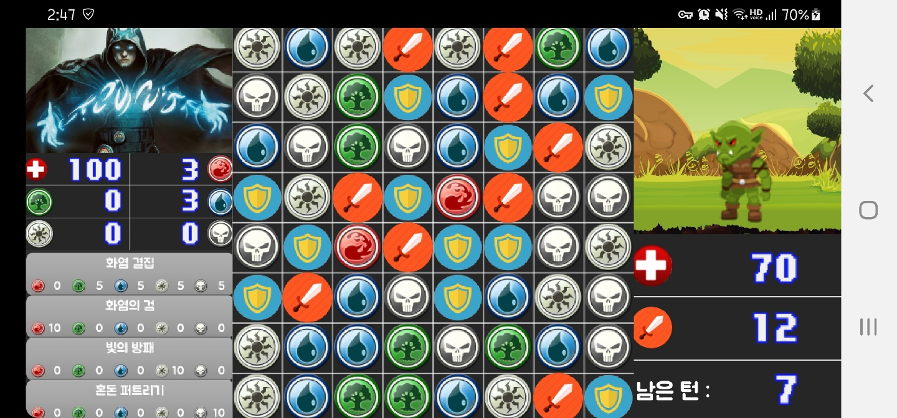
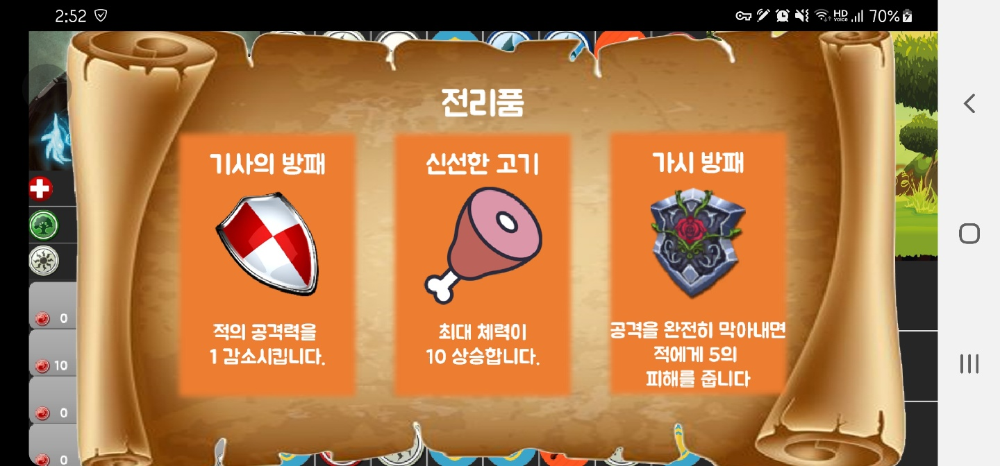
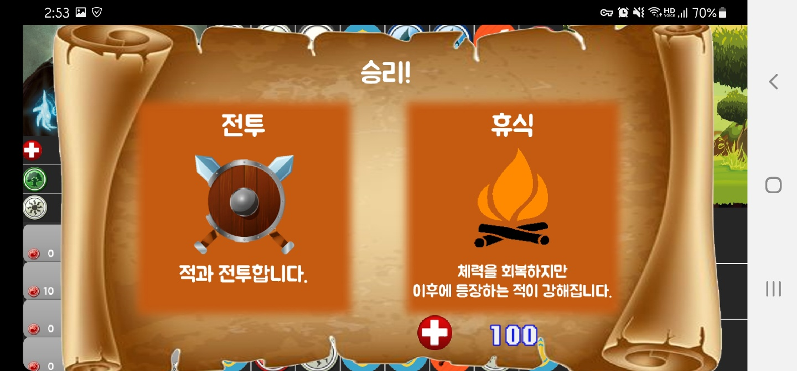
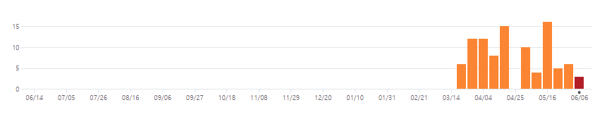

# 스마트폰 게임 프로그래밍

## Term Project 최종 발표

------

#### 게임 소개: 애니팡과 같은 3-매치 퍼즐 게임에  RPG 요소를 더한 게임

색깔 블럭을 파괴해 마나를 모아서 스킬을 사용하고, 검 블럭을 파괴해서 적을 공격하고, 방패 블럭을 파괴하여 적의 공격을 막는다.

적을 처치하면 랜덤으로 선택되는 보상 중에서 하나를 선택할 수 있다.

점점 강해지는 적들을 상대로 최대한 적을 많이 처치하는 것이 목표이다.

------

#### 진행 상황: 

|                         | 진행 정도 |                     비고                      |
| ----------------------- | :-------: | :-------------------------------------------: |
| 3-매치 게임 기본 베이스 |   100%    |                                               |
| 스킬                    |   100%    |              스킬 4종 구현 완료               |
| 적                      |   100%    |       각기 특성이 다른 적 3종 구현 완료       |
| 아이템                  |   100%    | 랜덤하게 보상으로 나오는 아이템 8종 구현 완료 |
| 로그라이크 요소         |   100%    |                                               |

------

#### 커밋 상황

|  주차  | 커밋 수 |
| :----: | :-----: |
| 1주차  |    2    |
| 2주차  |    0    |
| 3주차  |    0    |
| 4주차  |    0    |
| 5주차  |    0    |
| 6주차  |    0    |
| 7주차  |   16    |
| 8주차  |    5    |
| 9주차  |    6    |
| 10주차 |    3    |

------

#### 사용된 기술

GameObject의 ArrayList를 사용한 게임 루프

Scene의 Stack을 사용한 멀티플 씬

다양한 비트맵 클래스를 활용한 화면 그리기 / 충돌 처리

java enum을 사용한 적 정보(능력치, 모습 등) 추출

충돌 체크를 통한 터치 이벤트 처리

#### 참고한 것

수업 시간에 진행한 코드

#### 수업내용에서 차용한 것

기본 게임 루프

멀티플 씬 구조

비트맵 클래스 기본 구조

사운드

#### 직접 개발한 것

게임 컨텐츠 (3매치 퍼즐, 스킬, 아이템, 적 등)

게임오브젝트와 터치의 충돌 체크를 통한 상호작용

게임 오브젝트로 구성된 게임 UI

스프라이트를 사용한 이펙트

------

#### 아쉬운 점

좀 더 많은 컨텐츠 (스킬, 아이템, 적)를 만들었으면 더 재미있는 게임이 되었을 것 같다.

기기별 해상도 차이에 따른 문제점 해결이 어려웠다.

수업에서 다룬 멀티플 씬이 진행중이던 프로젝트에 적용하는 것이 까다로워서 어려움을 겪었다.